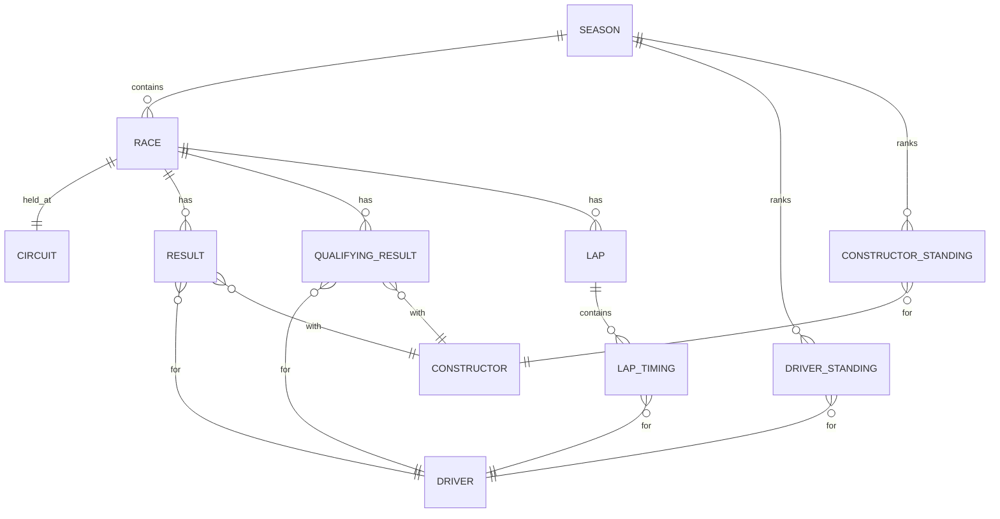
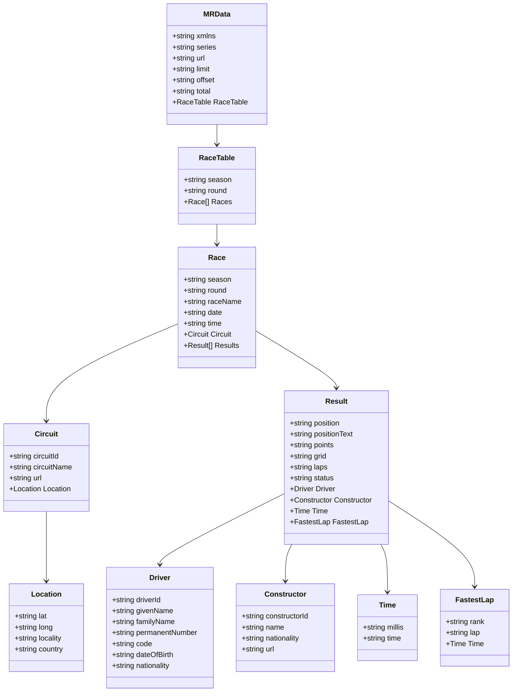

# Analisi tecnica e guida d’integrazione dell’API Ergast compatibile su api.jolpi.ca

## Sommario esecutivo

L’endpoint `https://api.jolpi.ca/ergast/` espone una versione “compatibile Ergast” dell’API `jolpica-f1`, pensata come sostituto dell’Ergast F1 API e per mantenere retro‑compatibilità con i pattern di interrogazione storicamente diffusi. La documentazione ufficiale elenca famiglie di endpoint (circuits, drivers, constructors, races, results, standings, lap times, ecc.) e definisce **una convenzione di risposta uniforme** basata sul wrapper `MRData`, con **paginazione tramite `limit`/`offset`** e limite massimo di pagina pari a 100 elementi. citeturn52view0

L’API è **read‑only**: dai test effettuati tramite l’interfaccia REST (Django REST Framework) risulta che gli endpoint accettano **GET** (oltre a HEAD/OPTIONS a livello HTTP). citeturn28view0turn29view0turn30view0

Sul fronte operatività, la documentazione ufficiale definisce rate limit **burst 4 richieste/secondo** e **sustained 500 richieste/ora** per accesso non autenticato, con possibilità futura di token per limiti più alti. citeturn50view0

Limiti funzionali rilevanti per un’app “live”: la piattaforma **non fornisce live timing durante la gara**; le lap time arrivano da documenti FIA post‑gara, quindi l’uso per leaderboard live è **non supportato**. citeturn48view0

Durante i test live (data di riferimento: **2026‑03‑25, Europe/Rome**) alcune risorse della stagione 2026 risultano popolate (es. `drivers`, `constructors`, `races`, `results`, `qualifying`, `laps`, `constructorstandings`), mentre altre appaiono **vuote o incoerenti** (es. `driverstandings` vuoto quando `constructorstandings` è valorizzato, `pitstops` e `sprint` vuoti, e variabilità nei campi di `laps`). Questi aspetti suggeriscono la necessità di gestire **dati incompleti/in aggiornamento** nel client. citeturn32view0turn32view1turn36view0turn38view0turn34view0turn35view0

## Scopo, metodologia e fonti

Questo report mira a:
- catalogare in modo rigoroso endpoint, metodi, parametri, formati e limiti documentati;
- descrivere schemi di risposta, paginazione e codici d’errore/gestione;
- eseguire test “chiave” per una tipica app F1 (drivers, teams, calendario, risultati, standings, lap times e verifica live timing);
- fornire linee guida di integrazione (caching, retry, normalizzazione, mapping a modelli applicativi), includendo rischi di qualità dati.

Fonti primarie:
- Sito API e interfaccia REST: `https://api.jolpi.ca/ergast/` e risorse collegate (risposte reali). citeturn1view0turn28view0turn29view0turn30view0  
- Documentazione ufficiale nel repository: panoramica, query params e campi comuni, endpoint specifici, rate limits, differenze rispetto a Ergast, termini d’uso. citeturn52view0turn50view0turn49view0turn51view0turn16view0turn17view0turn13view0turn14view0turn15view0turn20view0turn21view0turn22view0turn18view0turn9view0turn19view0  
- Riferimenti storici/contesto su Ergast (non più raggiungibile direttamente da `ergast.com/mrd/`): snapshot RSS di post di manutenzione (usato solo per contesto e motivazioni storiche, non come fonte normativa per l’API attuale). citeturn43view0

Nota: ove un dettaglio richiesto non sia presente nelle fonti ufficiali, viene dichiarato come **“non documentato”** (senza inferenze non verificabili).

## Architettura dell’API e convenzioni di chiamata

### Base URL, risorse e metodi HTTP

Il root `https://api.jolpi.ca/ergast/` restituisce una vista con riferimenti alle risorse principali (es. seasons, circuits, races, drivers, results, ecc.), utile per discovery. citeturn1view0

Dai test sugli endpoint “list” emerge:
- **Metodo**: `GET` (e a livello HTTP sono esposti `HEAD` e `OPTIONS`). citeturn28view0turn29view0turn30view0turn31view0
- **Formato risposta**: JSON (con `Content-Type: application/json` nell’interfaccia REST). citeturn28view0turn39view0
- **Nota implementativa**: la documentazione segnala che gli endpoint dovrebbero terminare con `/` oppure `.json`. citeturn52view0

### Autenticazione, API key e rate limit

Autenticazione:
- Accesso **non autenticato**: supportato e soggetto a limiti (burst/sustained). citeturn50view0
- Token: “in implementazione” per limiti più elevati. **Modalità di richiesta/uso del token (header, query param, scope)**: **non documentato**; la doc indica solo l’intenzione e l’effetto atteso (limiti più alti). citeturn50view0

Rate limits (documentati):
- Burst: **4 richieste/secondo**
- Sustained: **500 richieste/ora**
- Errore atteso oltre soglia: `HTTP 429 Too Many Requests` con messaggio “Request was throttled”. citeturn50view0

### Formato di risposta comune (`MRData`) e paginazione

Tutte le risposte condividono un wrapper `MRData` con campi standard: `series` (sempre `f1`), `xmlns` (vuoto per compatibilità), `url` (URL della risorsa **senza query parameters**), `limit`, `offset`, `total`. citeturn52view0

Paginazione (documentata e verificata):
- Query parameters globali:  
  - `limit` (default 30, max 100)  
  - `offset` (default 0) citeturn52view0
- Test su lap times: passando a pagina successiva nell’interfaccia REST, l’URL include `?offset=30` e la risposta riporta `MRData.offset="30"`, mentre `MRData.url` resta la base senza query (conferma della semantica documentata). citeturn35view0turn52view0

### Filtri e ordinamenti

Filtraggio:
- L’API usa principalmente **route parameters** (segmenti di path) per filtrare per stagione, round, driverId, constructorId, circuitId, ecc. Le combinazioni variano per endpoint e sono dettagliate nelle sezioni endpoint‑specifiche. citeturn16view0turn17view0turn13view0turn19view0turn20view0turn21view0turn22view0turn18view0turn14view0turn15view0
- Comportamento sui filtri duplicati: `jolpica-f1` ignora tutti tranne l’ultimo, mentre Ergast restituiva `400`. citeturn49view0

Ordinamento:
- Molti endpoint hanno ordinamenti “di default” (es. drivers/constructors in ordine alfabetico per id; seasons dal più vecchio al più recente; races in ordine cronologico). Questi ordinamenti sono esplicitati nei documenti endpoint‑specifici (es. Drivers, Constructors, Seasons, Races). citeturn16view0turn17view0turn18view0turn11view0  
- Parametri di sorting dedicati (es. `sort=`): **non documentati**.

### Formati data/ora e tempi di sessione

Formati principali osservati/documentati:
- `date`: `YYYY-MM-DD` (gare, sessioni, data di nascita piloti). citeturn30view0turn16view0turn18view0turn13view0
- `time` per gare/sessioni: tipicamente `HH:MM:SSZ` (UTC). citeturn30view0turn31view0turn37view0turn19view0turn13view0
- Tempi “prestazionali”:
  - Qualifica Q1/Q2/Q3 in formato tipo `m:ss.mmm` (stringhe; possono comparire stringhe vuote se non disponibile). citeturn20view0turn37view0
  - Laps `Timings[].time` in formato simile (stringhe). citeturn13view0turn34view0turn45view0
  - Pit stop: `time` in `HH:mm:ss`, `duration` in formato descritto come `MM:ss.sss` (in esempi appare anche come numero stringa con millisecondi, es. `"20.006"`). citeturn19view0  
- Dettaglio su `Time.time` nei results: differenza nota rispetto a Ergast: `Time.time` garantisce 3 cifre decimali (con zeri finali) e `positionText` usa `R` invece di `N`. citeturn49view0

### Errori e gestione errori

Documentato:
- `429 Too Many Requests` per rate limiting, con messaggio “Request was throttled”. citeturn50view0

Non documentato (quindi da trattare “best effort” lato client):
- struttura payload error (JSON con `detail`/`message`, ecc.);
- codici per input non valido (400), risorsa inesistente (404), errori server (5xx);
- header di rate limit (es. `Retry-After`) o di caching (ETag/Last-Modified).

## Catalogo completo degli endpoint e metadati richiesti

### Convenzioni comuni per tutti gli endpoint

Metodo HTTP: `GET` (oltre a `HEAD`/`OPTIONS` visibili in DRF). citeturn28view0turn39view0  
Autenticazione: nessuna per accesso base; token “in implementazione”. citeturn50view0  
Rate limit: 4 req/s e 500 req/h (non autenticato). citeturn50view0  
Query params condivisi:
- `limit` (int; default 30; max 100)
- `offset` (int; default 0) citeturn52view0

### Elenco endpoint (famiglie) ufficialmente documentate

La documentazione ufficiale elenca le seguenti famiglie e route principali; queste rappresentano il “catalogo” di base degli endpoint Ergast‑compatibili su questo servizio. citeturn52view0turn1view0

Di seguito, per ogni famiglia, riporto: **path base**, **parametri di percorso** (required/optional), **tipi e valori ammessi**, **esempi**.

#### API root

- **Path**: `/ergast/`
- **Metodo**: GET
- **Parametri**: nessuno
- **Esempio request**: `https://api.jolpi.ca/ergast/`
- **Esempio response**: lista di link alle risorse (seasons, circuit, race, ecc.). citeturn1view0

#### Circuits

- **Path base**: `/ergast/f1/circuits/` citeturn52view0turn9view0
- **Route parameters (optional)** (pattern composabili):
  - `season` (string): anno (es. `2024`) oppure `current`
  - `round` (string): numero round oppure `last`
  - `circuits/{circuitId}` (string)
  - `constructors/{constructorId}` (string)
  - `drivers/{driverId}` (string)
  - `grid/{gridPosition}` (string/int)
  - `results/{finishPosition}` (string/int)
  - `fastest/{lapRank}` (string/int)
  - `status/{statusId}` (string/int) citeturn9view0
- **Query params**: `limit`, `offset` (default come sopra). citeturn52view0
- **Response schema (alto livello)**: `MRData.CircuitTable.Circuits[]` con `Location` (lat/long/locality/country). citeturn9view0turn39view0
- **Esempio live (test)**: `https://api.jolpi.ca/ergast/f1/circuits/` restituisce `total=78` e una lista paginata. citeturn39view0

#### Constructors

- **Path base**: `/ergast/f1/constructors/` citeturn52view0turn17view0
- **Route parameters (optional)**:
  - `season`, `round`
  - `circuits/{circuitId}`
  - `constructors/{constructorId}`
  - `drivers/{driverId}`
  - `fastest/{lapRank}`
  - `grid/{gridPosition}`
  - `results/{finishPosition}`
  - `status/{statusId}` citeturn17view0
- **Response**: `MRData.ConstructorTable.Constructors[]` (campi principali: `constructorId`, `name`, `nationality`, `url`). citeturn17view0turn29view0
- **Esempio live (test, stagione 2026)**: `https://api.jolpi.ca/ergast/f1/2026/constructors/` restituisce `total=11` e la lista costruttori della stagione. citeturn29view0

#### Drivers

- **Path base**: `/ergast/f1/drivers/` citeturn52view0turn16view0
- **Route parameters (optional)**:
  - `season`, `round`
  - `circuits/{circuitId}`
  - `constructors/{constructorId}`
  - `drivers/{driverId}` (lookup puntuale)
  - `fastest/{lapRank}`
  - `grid/{gridPosition}`
  - `results/{finishPosition}`
  - `status/{statusId}` citeturn16view0
- **Response**: `MRData.DriverTable.Drivers[]` (con `driverId`, `givenName`, `familyName`; opzionali: `permanentNumber`, `code`, `dateOfBirth`, `nationality`). citeturn16view0turn28view0
- **Nota qualità dati (documentata)**: es. filtri per circuito possono escludere piloti che “partecipano al weekend” ma non partono in gara (documentato nel caso 2024 albert_park). citeturn16view0
- **Esempio live (test, stagione 2026)**: `https://api.jolpi.ca/ergast/f1/2026/drivers/` restituisce `total=22`. citeturn28view0

#### Seasons

- **Path base**: `/ergast/f1/seasons/` citeturn52view0turn18view0
- **Route parameters (optional)**:
  - `season` (anno o `current`) come filtro “stagione specifica”
  - `circuits/{circuitId}`
  - `constructors/{constructorId}`
  - `drivers/{driverId}`
  - `grid/{gridPosition}`
  - `status/{statusId}` citeturn18view0
- **Response**: `MRData.SeasonTable.Seasons[]` con `season` e `url`. citeturn18view0

#### Races (calendario e metadati evento)

- **Path base**: `/ergast/f1/races/` citeturn52view0turn11view0
- **Route parameters (optional)**:
  - `season` (anno o `current`)
  - `round` (numero round; supporto anche a `last` e `next` nel doc)
  - filtri “cross‑resource” (circuit/driver/constructor/grid/results/fastest/status) come negli altri endpoint storici citeturn11view0
- **Response**: `MRData.RaceTable.Races[]` con `Circuit`, `date`, `time` e sessioni (practice/qualifying/sprint) quando disponibili. citeturn11view0turn30view0turn49view0
- **Differenze note su naming sessioni**: SprintQualifying e SprintShootout rinominati rispetto a Ergast in alcuni anni (2024+ / 2023). citeturn49view0turn30view0
- **Esempio live (test, stagione 2026)**: `https://api.jolpi.ca/ergast/f1/2026/races/` restituisce `total=24` e include sessioni come `FirstPractice`, `Qualifying`, `Sprint`, `SprintQualifying`. citeturn30view0

#### Results (risultati gara)

- **Path base**: `/ergast/f1/results/` citeturn52view0turn12view0
- **Route parameters (optional)**:
  - `season`, `round` (incl. `last`)
  - `circuits/{circuitId}`
  - `constructors/{constructorId}`
  - `drivers/{driverId}`
  - `grid/{gridPosition}`
  - `results/{finishPosition}` (posizione di arrivo come filtro)
  - `fastest/{lapRank}`
  - `status/{statusId}` citeturn12view0turn49view0
- **Response**: `MRData.RaceTable.Races[].Results[]` con `Driver`, `Constructor`, `grid`, `laps`, `status`, `Time` (millis/time) e `FastestLap` (rank/lap/Time/… quando presente). citeturn12view0turn31view0
- **Esempio live (test, stagione 2026)**: `https://api.jolpi.ca/ergast/f1/2026/results/` restituisce risultati inclusivi di `FastestLap` e `Time`. citeturn31view0

#### Qualifying (qualifiche)

- **Path base**: `/ergast/f1/qualifying/` citeturn52view0turn20view0
- **Route parameters (optional)**:
  - `season`, `round` (nel doc anche `next`)
  - `circuits/{circuitId}`
  - `constructors/{constructorId}`
  - `drivers/{driverId}`
  - `grid/{gridPosition}` (nota: può riflettere penalità; doc include esempi)
  - `fastest/{lapRank}`
  - `status/{statusId}` citeturn20view0
- **Response**: `MRData.RaceTable.Races[].QualifyingResults[]` con `Q1`, `Q2`, `Q3` (stringhe). citeturn20view0turn37view0
- **Esempio live (test, stagione 2026)**: `https://api.jolpi.ca/ergast/f1/2026/qualifying/` restituisce `total=19` (es. una griglia ridotta/assenze) e include Q1/Q2/Q3. citeturn37view0

#### Sprint (risultati sprint)

- **Path base**: `/ergast/f1/sprint/` citeturn52view0turn21view0
- **Route parameters (optional)**:
  - `season`, `round`
  - `circuits/{circuitId}`
  - `constructors/{constructorId}`
  - `drivers/{driverId}`
  - `grid/{gridPosition}`
  - `status/{statusId}` citeturn21view0
- **Response**: `MRData.RaceTable.Races[].SprintResults[]` con `points`, `Time`, `FastestLap`, ecc. citeturn21view0
- **Esempio live (test, stagione 2026)**: `https://api.jolpi.ca/ergast/f1/2026/sprint/` risulta vuoto (`total=0`) alla data del test. Interpretazione: dati non disponibili/aggiornamento in corso; non documentato se e quando viene popolato. citeturn38view0

#### Laps (lap times)

- **Path base**: `/ergast/f1/{season}/{round}/laps/` citeturn52view0turn13view0
- **Route parameters**:
  - `season` (**required**): anno o `current`
  - `round` (**required**): numero round o `last` citeturn13view0
- **Route parameters (optional)**:
  - `drivers/{driverId}` (lap times per pilota)
  - `constructors/{constructorId}` (lap times per team)
  - `laps/{lapNumber}` come filtro (attenzione a precedenze se specificato anche in coda)
  - `{lapNumber}` in coda dopo `/laps/` (es. `/laps/1/`) citeturn13view0turn44view0
- **Range storico**: dati disponibili dal 1996 (doc). citeturn13view0
- **Response**: `MRData.RaceTable.Races[].Laps[]` e `Laps[].Timings[]` con `driverId`, `position`, `time` (ma vedi note qualità dati). citeturn13view0turn34view0turn45view0

#### Pitstops

- **Path base**: `/ergast/f1/{season}/{round}/pitstops/` citeturn52view0turn19view0
- **Route parameters**:
  - `season` (**required**), `round` (**required**) citeturn19view0
- **Route parameters (optional)**:
  - `{stopNumber}` in coda
  - `drivers/{driverId}`
  - `laps/{lapNumber}` citeturn19view0
- **Range storico**: dati dal 2011 (doc). citeturn19view0
- **Response**: `MRData.RaceTable.Races[].PitStops[]` con `time` e `duration`. citeturn19view0
- **Esempio live (test, 2026 round 1)**: endpoint vuoto (`total=0`) alla data del test. Non documentato se per stagione corrente i pit stop arrivino con ritardo o via aggiornamenti successivi. citeturn36view0

#### Driver Standings

- **Path base**: `/ergast/f1/{season}/driverstandings/` citeturn52view0turn14view0
- **Route parameters**:
  - `season` (**required**) citeturn14view0turn49view0
- **Route parameters (optional)**:
  - `{round}` (numero o `last`)
  - `drivers/{driverId}`
  - `{finishPosition}` in coda dopo `/driverstandings/` (filtra una singola posizione) citeturn14view0
- **Response**: `MRData.StandingsTable.StandingsLists[].DriverStandings[]`. citeturn14view0
- **Esempio live (test, 2026)**: risposta vuota (`total=0`, `StandingsLists=[]`) pur con `constructorstandings` valorizzato. Va gestito lato app come “dati non ancora disponibili”. citeturn32view0turn32view1

#### Constructor Standings

- **Path base**: `/ergast/f1/{season}/constructorstandings/` citeturn52view0turn15view0
- **Route parameters**:
  - `season` (**required**) citeturn15view0turn49view0
- **Route parameters (optional)**:
  - `{round}` (numero o `last`)
  - `constructors/{constructorId}`
  - `{finishPosition}` in coda (filtra una singola posizione) citeturn15view0
- **Response**: `MRData.StandingsTable.StandingsLists[].ConstructorStandings[]`. citeturn15view0turn32view1

#### Status (finishing status counts)

- **Path base**: `/ergast/f1/status/` citeturn52view0turn22view0
- **Route parameters (optional)**:
  - `season`, `round`, `circuits/{circuitId}`, `constructors/{constructorId}`, `drivers/{driverId}`, `grid/{gridPosition}`, `results/{finishPosition}`, `fastest/{lapRank}`, `status/{statusId}` citeturn22view0
- **Response**: `MRData.StatusTable.Status[]` (oggetti con `statusId`, `count`, `status`). Ordinamento per `count` (differenza rispetto a Ergast). citeturn22view0turn49view0
- **Nota forward‑compatibility**: la doc avverte che gli `statusId` potrebbero cambiare per stagioni pre‑2024 e raccomanda di affidarsi solo a un sottoinsieme di valori “stabili” (Finished/Disqualified/Accident/Retired/Lapped), con possibili cambi futuri. citeturn22view0turn49view0

### Diagramma relazionale consigliato per normalizzazione dati (modello app)



Il diagramma riflette la struttura dei payload (`RaceTable`, `StandingsTable`, oggetti `Circuit`, `Driver`, `Constructor`) e facilita la deduplicazione/normalizzazione nel database applicativo. citeturn31view0turn37view0turn34view0turn15view0turn14view0

### Esempio di “JSON schema chart” per una risposta `results`



Lo schema è derivato dai campi descritti nei documenti di `results` e da un payload reale (test 2026). citeturn12view0turn31view0turn52view0

## Test funzionali e snippet per endpoint chiave

### Nota sulla modalità di test

Le chiamate “live” sono state verificate tramite l’interfaccia REST del servizio (che mostra il payload JSON restituito da GET). Alcuni endpoint, alla data del test, risultano non popolati per la stagione corrente: questi casi vengono indicati come “risposta vuota” e vanno gestiti come condizione normale lato client. citeturn28view0turn29view0turn30view0turn31view0turn32view0turn36view0turn38view0turn35view0

### Drivers

**Obiettivo app**: elenco piloti (profilo, filtri per stagione), lookup per `driverId`.

**Request (curl)**

```bash
# Elenco piloti stagione 2026 (esempio live)
curl -s "https://api.jolpi.ca/ergast/f1/2026/drivers/" | jq '.MRData.DriverTable.Drivers[0:3]'
```

**Request (JavaScript fetch, commenti in italiano)**

```js
// Recupera l'elenco piloti per una stagione specifica
// Nota: MRData.limit/offset/total sono stringhe
const url = "https://api.jolpi.ca/ergast/f1/2026/drivers/";

const res = await fetch(url);
if (!res.ok) throw new Error(`HTTP ${res.status}`);
const data = await res.json();

console.log(data.MRData.DriverTable.Drivers.slice(0, 3));
```

**Request (JavaScript axios, commenti in italiano)**

```js
// Esempio equivalente con axios
import axios from "axios";

const url = "https://api.jolpi.ca/ergast/f1/2026/drivers/";
const { data } = await axios.get(url);

console.log(data.MRData.total, data.MRData.DriverTable.Drivers.length);
```

**Response attesa (estratto)**: `MRData.total="22"` e lista di oggetti driver con `driverId`, `givenName`, `familyName`, ecc. citeturn28view0

### Teams / Constructors

**Obiettivo app**: elenco team stagione corrente, profilo team.

**curl**

```bash
# Elenco costruttori stagione 2026
curl -s "https://api.jolpi.ca/ergast/f1/2026/constructors/" | jq '.MRData.ConstructorTable.Constructors'
```

**fetch**

```js
// Elenco costruttori (teams) per stagione
const url = "https://api.jolpi.ca/ergast/f1/2026/constructors/";
const data = await (await fetch(url)).json();

for (const c of data.MRData.ConstructorTable.Constructors) {
  // c.constructorId è l'ID stabile per i join nel tuo DB
  console.log(c.constructorId, c.name);
}
```

**Risposta attesa**: `MRData.total="11"` e `ConstructorTable.Constructors[]`. citeturn29view0

### Races / Calendario

**Obiettivo app**: calendario stagione (date, circuito, sessioni, sprint).

**curl**

```bash
# Calendario stagione 2026 (prime gare)
curl -s "https://api.jolpi.ca/ergast/f1/2026/races/" | jq '.MRData.RaceTable.Races[0:2]'
```

**fetch**

```js
// Carica calendario e costruisci un modello Race in app
const url = "https://api.jolpi.ca/ergast/f1/2026/races/";
const data = await (await fetch(url)).json();

const races = data.MRData.RaceTable.Races.map(r => ({
  season: r.season,
  round: Number(r.round),
  name: r.raceName,
  dateUTC: `${r.date}T${(r.time ?? "00:00:00Z")}`, // attenzione: alcune sessioni possono mancare
  circuitId: r.Circuit.circuitId,
}));

console.log(races[0]);
```

**Risposta attesa (estratto)**: `MRData.total="24"` e per ogni race: `Circuit`, `date`, `time`, e sessioni come `FirstPractice`, `Qualifying`, `Sprint`, `SprintQualifying` quando applicabili. citeturn30view0turn49view0

### Results (risultati gara)

**Obiettivo app**: classifica di una gara, storico stagione, driver results.

**curl**

```bash
# Risultati disponibili per la stagione 2026 (alla data del test include round 1)
curl -s "https://api.jolpi.ca/ergast/f1/2026/results/" | jq '.MRData.RaceTable.Races[0].Results[0:5]'
```

**fetch**

```js
// Recupera risultati e normalizza Driver/Constructor in tabelle separate
const url = "https://api.jolpi.ca/ergast/f1/2026/results/";
const data = await (await fetch(url)).json();

const race = data.MRData.RaceTable.Races[0];
const results = race.Results.map(r => ({
  position: Number(r.position),
  driverId: r.Driver.driverId,
  constructorId: r.Constructor.constructorId,
  points: Number(r.points),
  status: r.status,
  time: r.Time?.time ?? null,
}));

console.log(race.raceName, results.slice(0, 3));
```

**Risposta attesa (estratto)**: oggetti `Results[]` con `Driver`, `Constructor`, `Time`, `FastestLap`. citeturn31view0

### Standings (driver e constructor)

**Obiettivo app**: classifica campionato.

**Constructor standings (live test)**

```bash
curl -s "https://api.jolpi.ca/ergast/f1/2026/constructorstandings/" \
 | jq '.MRData.StandingsTable.StandingsLists[0].ConstructorStandings[0:5]'
```

Risposta attesa: `StandingsTable.round="1"` e lista `ConstructorStandings[]`. citeturn32view1

**Driver standings (live test)**

```bash
curl -s "https://api.jolpi.ca/ergast/f1/2026/driverstandings/" | jq '.MRData'
```

Alla data del test: risposta vuota (`total="0"`, `StandingsLists=[]`). In un client robusto va resa come “standings non disponibili” (senza crash e senza assunzioni). citeturn32view0turn14view0

### Lap times / Laps

**Obiettivo app**: confronti giro‑per‑giro, pace chart, analisi stint (nei limiti dei dati).

**curl (paginazione via offset)**

```bash
# Prima pagina (default limit=30)
curl -s "https://api.jolpi.ca/ergast/f1/2026/1/laps/" | jq '.MRData.offset, .MRData.limit, .MRData.total'

# Pagina successiva usando offset (esempio verificato nell'interfaccia REST)
curl -s "https://api.jolpi.ca/ergast/f1/2026/1/laps/?offset=30" | jq '.MRData.offset, .MRData.limit, .MRData.total'
```

**fetch (pattern di paging)**

```js
// Esempio: paging con offset (limite max 100, default 30)
// NB: MRData.total è stringa -> convertire a Number
const base = "https://api.jolpi.ca/ergast/f1/2026/1/laps/";
let offset = 0;

while (true) {
  const url = `${base}?offset=${offset}`;
  const data = await (await fetch(url)).json();

  const total = Number(data.MRData.total);
  const pageSize = Number(data.MRData.limit);
  const lapsChunk = data.MRData.RaceTable.Races?.[0]?.Laps ?? [];

  // Salva/normalizza lapsChunk nel tuo datastore
  console.log("offset", offset, "lapsInPayload", lapsChunk.length);

  offset += pageSize;
  if (offset >= total) break;
}
```

**Risposta attesa**:
- `MRData.total` molto elevato (nel test 2026 round 1: `total="1003"`), riflettendo l’alta cardinalità dei record lap timing. citeturn34view0turn35view0
- Inconsistenze osservate nei campi dei `Timings[]` (vedi sezione “qualità dati”). citeturn34view0turn35view0

**Lap times per driver e per lapNumber (test reale via endpoint .json)**

```bash
# Esempio puntuale: 2024 round 1, driver norris, lap 1 (risposta JSON singola)
curl -s "https://api.jolpi.ca/ergast/f1/2024/1/drivers/norris/laps/1.json" | jq '.MRData.RaceTable.Races[0].Laps[0]'
```

Risposta attesa: `Laps[0].Timings[0]` con `position` e `time`. citeturn45view0turn44view0

### Live timing

Non presente: in una discussione ufficiale del progetto viene chiarito che l’API **non può** fornire lap‑by‑lap live durante la gara, perché le lap time derivano da documenti entity["organization","FIA","motorsport governing body"] post‑gara; per live data vengono citate alternative esterne (es. altri pacchetti, potenzialmente con abbonamento live timing). citeturn48view0

## Linee guida di integrazione e note di qualità dati

### Caching e riduzione chiamate

Dato il rate limit (4/s e 500/h) e la natura spesso “storica” dei dati, è essenziale un caching multi‑livello:
- Cache HTTP lato client (in‑memory) per schermate ripetute.
- Cache persistente (DB locale / Redis / KV store) per dataset stabili (stagioni concluse, anagrafiche circuiti/piloti).
- Strategia raccomandata dalla doc: preferire query con filtri e paging (`limit`/`offset`) invece di molte chiamate granulari (es. “lap by lap”). citeturn50view0

Suggerimento pragmatico per TTL:
- Dati storici (stagioni passate): TTL lungo (giorni/settimane).
- Stagione corrente: TTL corto su `races`, `results`, `standings` (minuti/ore) e invalidazione manuale dopo eventi.

Header ETag/Last-Modified: **non documentato**; implementare caching applicativo indipendente.

### Retry, backoff ed error handling

Per robustezza in produzione:
- Su `429` applicare backoff esponenziale con jitter e rispettare un limite massimo di retry; il messaggio “Request was throttled” indica superamento limiti burst/sustained e può dipendere da IP condiviso. citeturn50view0
- Su 5xx: retry limitato (es. 2–3 tentativi) e fallback a cache.
- Su payload vuoto inatteso (es. standings): non considerarlo errore fatale; mostrare “dati non disponibili”.

Poiché la struttura degli error payload è **non documentata**, l’approccio consigliato è:
- usare `res.ok`/status code;
- loggare `status`, `url`, e un estratto di body;
- telemetria lato app per monitorare pattern di fallimento.

### Normalizzazione dati e mapping a modelli applicativi

Caratteristiche tipiche dei payload:
- molti campi numerici sono stringhe (`points`, `position`, `round`, `total`, ecc.) → convertire esplicitamente. citeturn31view0turn52view0
- oggetti annidati ripetuti (Driver, Constructor, Circuit) → deduplicare in tabelle/collezioni separate usando chiavi stabili (`driverId`, `constructorId`, `circuitId`). citeturn31view0turn30view0turn28view0turn29view0

Flow consigliato per una schermata “gara” (non live):

```mermaid
flowchart TD
  A[Carica calendario /races] --> B[Seleziona season+round]
  B --> C[Carica risultati /{season}/{round}/results]
  B --> D[Carica qualifica /{season}/{round}/qualifying]
  B --> E[Carica lap times /{season}/{round}/laps con paging]
  C --> F[Normalizza Driver/Constructor/Circuit]
  D --> F
  E --> F
  F --> G[Aggiorna UI + cache persistente]
```

La doc evidenzia che `MRData.url` non include query params: conviene salvare in cache anche la **chiave di richiesta completa** (endpoint + query). citeturn52view0turn35view0

### Qualità dati e inconsistenze osservate / note

Inconsistenze e rischi emersi:

1) **Standings incompleti nella stagione corrente**: nel test 2026, `driverstandings` è vuoto mentre `constructorstandings` è popolato. L’app deve gestire stati parziali (UI “non disponibile”). citeturn32view0turn32view1

2) **Endpoint vuoti per pit stop e sprint** nella stagione 2026 al momento del test (risposte `total=0`). Non è documentato se ciò sia atteso per timing di aggiornamento o pipeline dati; quindi è opportuno progettare feature “optional” e fallback. citeturn36view0turn38view0turn19view0turn21view0

3) **Variabilità dei campi nel payload lap times**:
   - in un payload, i `Timings[]` includono `position: "None"`; in un’altra pagina (offset diverso) il campo `position` è assente e rimane solo `driverId`+`time`. Questo richiede parsing tollerante e validazione a runtime. citeturn34view0turn35view0

4) **Nota su status e statusId**: il progetto dichiara possibili cambi futuri negli status (enumerazione, raggruppamenti “Retired” vs “Accident”) e raccomanda di non affidarsi a tutti gli statusId storici. Questo incide su filtri e analytics longitudinali. citeturn22view0turn49view0

5) **Storico di correzioni lap times**: esiste un issue che segnala lap times errati per 2024; in un test attuale su quell’URL il valore riportato risulta corretto (indicando che le correzioni possono avvenire nel tempo). In generale, per analytics “definitive”, prevedere capacità di re‑import/refresh. citeturn44view0turn45view0

## Sicurezza, CORS e aspetti legali

### Sicurezza e accesso

- Autenticazione: non richiesta per uso base; token in implementazione. citeturn50view0
- API keys: **non documentato** (nessun header/parametro ufficiale indicato).
- CORS: **non documentato** (non sono presenti riferimenti espliciti nelle guide consultate). In applicazioni browser è consigliabile prevedere un backend proxy se emergono vincoli CORS.

### Termini d’uso e licensing dati

Il file “Terms of Use” dichiara:
- uso gratuito **non commerciale**;
- dati sotto licenza **CC BY‑NC‑SA 4.0**, con riferimento al sito di entity["organization","Creative Commons","cc license steward"];
- uso commerciale soggetto a contatto (email indicata);
- possibilità di blocco per abuso e assenza di garanzie su uptime/correttezza dati (progetto volontario). citeturn51view0

Implicazioni pratiche:
- se l’app è monetizzata o usata in contesto commerciale, serve chiarimento/licenza.
- in UI e documentazione interna prevedere attribuzione e rispetto delle clausole NC/SA.

Il progetto usa piattaforme e comunicazioni via entity["company","GitHub","code hosting platform"] per annunci di cambiamenti rilevanti. citeturn51view0turn47view0

## Matrice di utilità per funzionalità app e set minimo consigliato

### Tabella comparativa endpoint ↔ feature

| Endpoint | Driver profiles | Race calendar | Live leaderboard | Historical stats |
|---|---|---|---|---|
| `/drivers/` | Alta | Bassa | Nessuna | Media |
| `/constructors/` | Media | Bassa | Nessuna | Media |
| `/circuits/` | Media | Media | Nessuna | Media |
| `/races/` | Media | **Alta** | Nessuna | Alta |
| `/results/` | Media | Media | Bassa (post‑gara) | **Alta** |
| `/qualifying/` | Media | Media | Bassa (post‑sessione) | Alta |
| `/driverstandings/` | Media | Bassa | Nessuna | Alta (se disponibile) |
| `/constructorstandings/` | Media | Bassa | Nessuna | Alta |
| `/laps/` | Bassa | Bassa | Nessuna (no live) | Alta (analisi passo) |
| `/pitstops/` | Bassa | Bassa | Nessuna | Media |
| `/sprint/` | Media | Media | Nessuna (no live) | Media |
| `/status/` | Bassa | Bassa | Nessuna | Media (analisi DNFs) |

La colonna “Live leaderboard” è necessariamente limitata: il progetto dichiara esplicitamente di non offrire live timing. citeturn48view0

### Set minimo consigliato per una prima versione (MVP)

Per un MVP “storico + calendario” (senza live):

1) **Calendario**: `/ergast/f1/{season}/races/` – per calendario e sessioni. citeturn52view0turn11view0turn30view0  
2) **Anagrafiche**: `/drivers/` e `/constructors/` – per profili (driverId/constructorId come chiavi). citeturn16view0turn17view0turn28view0turn29view0  
3) **Risultati**: `/results/` – per classifiche gara e punti. citeturn12view0turn31view0  
4) **Standings**: `/constructorstandings/` e `/driverstandings/` – con fallback se vuoti/non disponibili. citeturn15view0turn14view0turn32view0turn32view1  
5) **Approfondimenti** (seconda iterazione): `/qualifying/`, `/laps/`, `/status/` per analytics e insight. citeturn20view0turn13view0turn22view0  

Per un prodotto che richiede “live leaderboard”, questa API non è sufficiente: occorre integrare un’altra sorgente dati live (non parte di questo set) o accettare leaderboard “post‑gara”. citeturn48view0